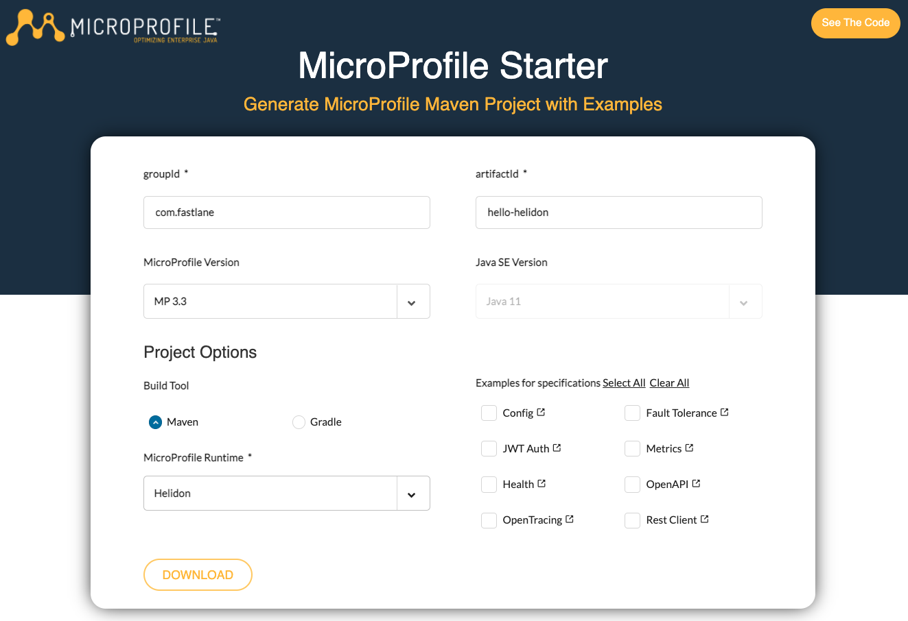

# Getting started with Helidon

## Introduction

### What you will learn

Here are the key learnings you will get with this hands-on execise:

* Learn how to use the microprofile starter to generate your first Microprofile application, using Helidon as the runtime;
* Explore the basic structure of a Helidon project;
* Learn how to use Helidon CLI;
* Check the experience of the Dev Loop with Helidon CLI.

## Pre requisites

To be able to go through this guided exercise, you will need to have the following components in your dev environment:

* Have finished the steps described in [Preparing your environment](00_environment.md)

## Hands-on practice

### Creating a new project 

1. Let's create a new project using mp starter. Access the page [https://start.microprofile.io/](https://start.microprofile.io/).
   

2. Use the following the data and click on download. You will get a zip file with an automatically generated project for you to get started.

      | Method      | Description                          |
      | ----------: | -----------------------------------: |
      | groupId       | com.fastlane  |
      | artifactId       | hello-helidon |
      | MicroProfile Version    | 3.3 |
      | Build Tool | Maven | 
      | MicroProfile Runtime | Helidon |
   
3. Unzip the file `hello-helidon.zip`. You should have a project structure like this:
   ```shell
   .
   ├── pom.xml
   ├── readme.md
   └── src
   └── main
   ├── java
   │   └── com
   │       └── fastlane
   │           └── hello
   │               └── helidon
   │                   ├── HelloController.java
   │                   └── HellohelidonRestApplication.java
   └── resources
   ├── META-INF
   │   ├── beans.xml
   │   └── microprofile-config.properties
   ├── WEB
   │   └── index.html
   ├── logging.properties
   └── privateKey.pem
   ```

4. Explore the classes and check what is available out of the box, when we don't select any extra features in the starter page.

### Running the project

5. Open the terminal and access the project's folder. 

6. Run the following maven command. Maven will download the dependencies described in the project's `pom.xml` file. It will also create an executable jar we can use to access our application: `hello-payara-microbundle.jar`.
   ```shell
   mvn clean package
   ```

7. Now, let's start our first Helidon service. In the terminal, run the following command:
   ```bash
   java -jar target/hello-helidon.jar
   ```

8. If everything goes well, you should see an output similar to:
   ```
    INFO io.helidon.microprofile.server.ServerCdiExtension !thread!: Server started on http://localhost:8080 (and all other host addresses) in 2319 milliseconds (since JVM startup).
    INFO io.helidon.common.HelidonFeatures !thread!: Helidon MP 2.4.1 features: [CDI, Config, Fault Tolerance, Health, JAX-RS, Metrics, Open API, REST Client, Security, Server, Tracing]
   
   ```

9. In your browser, access the page [http://localhost:8080/data/hello](http://localhost:8080/data/hello)

    !!! question "What are the classes that are responding to this request?" 

10. Now change the message that is displayed in this page. 
11. Package your application, start it again, and check the changes on the page. 

!!! success "Congratulations"
    You've successfully created, packaged, changed and accessed an application based on the MicroProfile specification and that runs with the Helidon runtime!

## Using Helidon CLI [Optional]

You can use Helidon CLI for executing tasks like creating new projects and using a feature called "Developer Loop". The Developer Loop allows you to leverage hot reload features while coding your helidon services.

1. Using a terminal, access your project's folder `hello-helidon`.
2. Run the app using the dev loop with:
    ```shell
    helidon dev
    ```
3. After the tool finishes downloading the artifacts, you should be able to see something like:
```shell
| downloading artifacts
| building
| build completed (1.9 seconds)
| hello-helidon starting

...

2022.05.27 22:59:32 INFO io.helidon.common.HelidonFeatures !thread!: Helidon MP 2.4.1 features: [CDI, Config, Fault Tolerance, Health, JAX-RS, Metrics, Open API, REST Client, Security, Server, Tracing]
```

    !!! Bug "Alert"
        Sometimes the dev loop might not work on the first initialization of helidon dev. To avoid issues, you can stop the service with ctrl+c (or cmd+c) and start it again with  `helidon dev`.

4. Open the service in your browser: [http://localhost:8080/data/hello](http://localhost:8080/data/hello)

5. On your IDE, open the class `com.fastlane.hello.helidon.HelloController` 
6. Change the endpoint path to `devloop` and the string returned by the method `sayHello` to `"Hello Dev Loop!"` 
7. Back in your browser, check your changes reflected at [http://localhost:8080/data/devloop](http://localhost:8080/data/devloop)

## Additional information

When you are you GraalVM, you can compile your helidon services using Ahead of Time compilation. AoT is a strategy to have the compilation processing during build time, allowing you to create native executable files with fast startup time.

For more information check the [Helidon docs for Helidon SE GraalVM native image](https://helidon.io/docs/v2/#/se/aot/01_introduction). 
